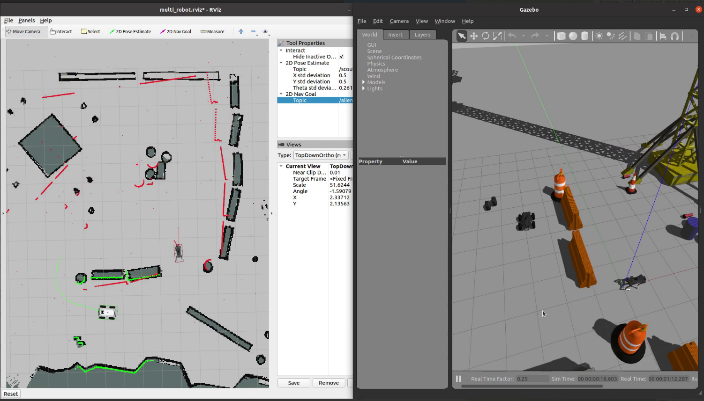
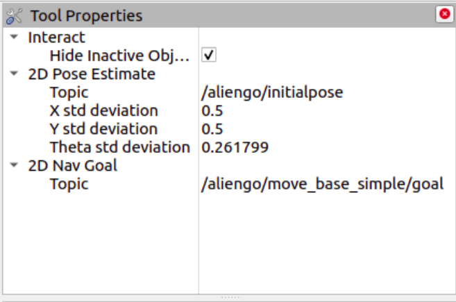
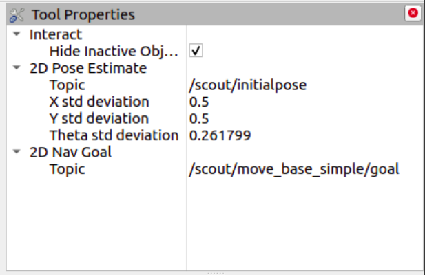

# Multi Robot Navigation

 

This repository is a workspace that contains some ROS packages for spawning dual robot with ROS Navigation Stack in the gazebo simulation.
 

Supported Robots:

- [*Scout Robot*](https://global.agilex.ai/products/scout-2-0) : Skid-Steer Robot - Wheeled Robot
- [*Unitree Aliengo*](https://www.unitree.com/aliengo/) : Quadruped Robot - Legged Robot

Tested on ROS Noetic

---
## Framework
This framework based on some open-source frameworks :
- [*ROS Navigation Stack*](http://wiki.ros.org/navigation) :
  - Global Planner: [*Navfn ROS*](http://wiki.ros.org/navfn) 
  - Local Planner: [*DWA Local Planner*](http://wiki.ros.org/dwa_local_planner) 

- *Control Framework* :
  - Wheeled Robot:  [*diff_drive_controller*](http://wiki.ros.org/diff_drive_controller) 
  - Quadruped Robot:  [*CHAMP*](https://github.com/chvmp/champ) 

- *Robot Model - URDF* :
  - [*Scout ROS*](https://github.com/agilexrobotics/scout_ros) - I did some modification on this
  - [*Unitree ROS*](https://github.com/chvmp/unitree_ros) 

---
## Installation
    sudo apt-get install -y ros-noetic-diff-drive-controller ros-noetic-tf2-ros
    sudo apt install -y python-rosdep
    mkdir -p multi_robot_ws/src
    cd multi_robot_ws/src
    git clone --recursive https://github.com/billynugrahas/multi-robot-simulation
    cd ..
    rosdep install --from-paths src --ignore-src -r -y
    catkin_make
    source devel/setup.bash

---
## Quick Start
Check the commands below
### Run the scout only in the gazebo
    roslaunch scout_gazebo gazebo_scout.launch

### Run the aliengo only in the gazebo
    roslaunch aliengo_gazebo gazebo_aliengo.launch

### Teleop Keyboard the aliengo in the gazebo
    rosrun champ_teleop champ_teleop.py cmd_vel:=/aliengo/cmd_vel

### Teleop Keyboard the scout in the gazebo
    rosrun teleop_twist_keyboard teleop_twist_keyboard.py cmd_vel:=/scout/cmd_vel
### Run scout and aliengo (dual robot) in the gazebo
    roslaunch scout_aliengo_gazebo_navigation dual_robot_gazebo.launch

### Run the navigation stack for scout and aliengo (dual robot)
    roslaunch scout_aliengo_gazebo_navigation dual_robot_navigation.launch

### Change the worlds
    - edit the `world_name` parameters in *scout_aliengo_gazebo_navigation/launch/dual_robot_gazebo.launch*
### Change the map
  - edit the `map_file` parameters in *scout_aliengo_gazebo_navigation/launch/dual_robot_navigation.launch*
  
### Set 2D Pose and 2D Goal in the rviz
  - open rviz, on the Tool Properties, change the Topic at the 2D Pose Estimate and 2D Nav Goal section, whether "/aliengo/..." or "/scout/..."
  - Check the pictures below: 
  
     

     
